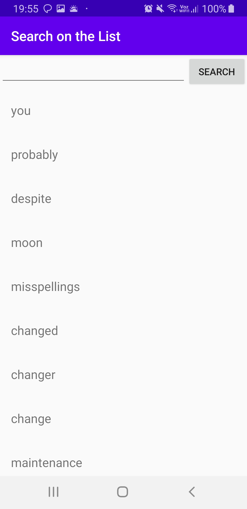

# 4. [Android] Search on a list:
Write an application with one activity that shows a list of items and a search box. The
user expects that the search returns a result even if word typed is partially permuted
or it has one typo (like explained on previous problems), but not both.

## Solution 
```
It was created an activity to resolve the problem, as you can see in the screenshots below:
There is a search box where is typed the word (even if it is partially permuted or it has one typo), and after clicked in the search button, the result is a list relative to the typed word.
```

## Screenshots
```

```

